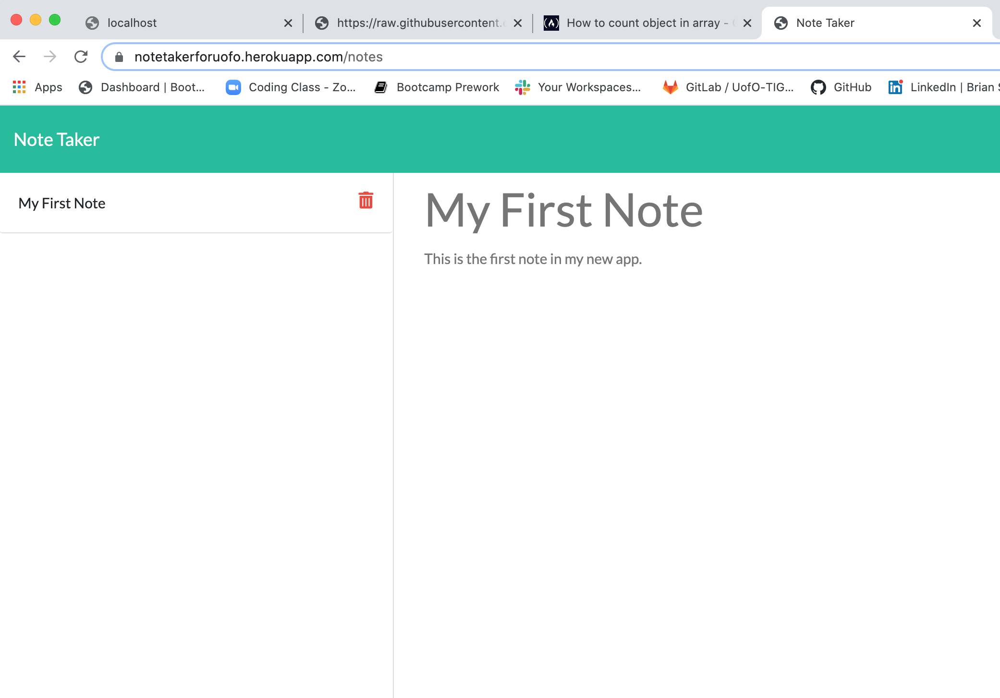

# Unit 11 Express Homework: Note Taker
    
## Description: 

Our task was to create an application that can be used to write, save, and delete notes. This application uses and express backend and save and retrieve note data from a JSON file.

* The application frontend was already created.
* The following HTML routes were created:
  * GET `/notes` - Returns the `notes.html` file.
  * GET `*` - Returns the `index.html` file
* The application has a `db.json` file on the backend that will be used to store and retrieve notes using the `fs` module.
* The following API routes were created:
  * GET `/api/notes` - Read the `db.json` file and returns all saved notes as JSON.
  * POST `/api/notes` - Receives a new note to save on the request body, adds it to the `db.json` file, and then returns the new note to the client.
  * DELETE `/api/notes/:id` - Receives a query parameter containing the id of a note to delete. 
    
## Table of Contents: 

* [License](#license)
* [Installation](#installation)
* [Tests](#tests)
* [Usage](#usage)
* [Technology Used](#technology-used)
* [Contributing](#contributing)
* [Questions](#questions)
* [Link](#link)
* [Image](#image)

    
## Installation: 

To install the needed dependencies, please run the following command: npm i, npm i express, node server.js
    
## Usage: 
    
Special instructions for usage: Make sure you install all of the npm dependencaies mentioned above. Fork the repo to your GitHub account and run: node server.js

## Technology Used: 
    
Technologies used in this application: Javascript, HTML5, CSS3, Node.js, Express, Heroku
    
## License: 
    
This project is licensed as: 
    
## Contributing: 

There are no special requirements for using this repo.
    
## Tests: 

Be sure to run the following test(s): None
    
## Questions: 
    
If you have any questions, please reach out to [BrianSoldani](https://github.com/BrianSoldani) @ briansoldani@gmail.com.

## Link: 

https://notetakerforuofo.herokuapp.com/

## Image:

